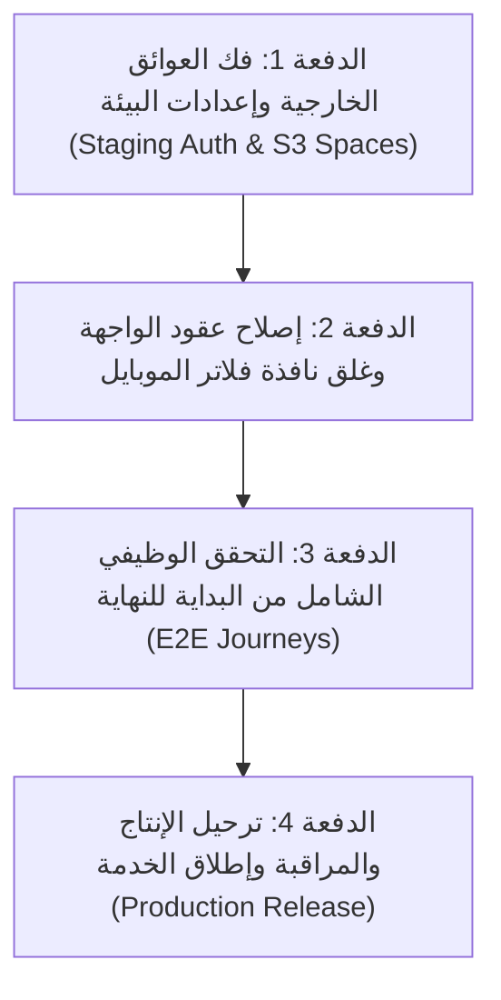

# تقرير المراجعة الشاملة لجاهزية الإنتاج — Production Readiness Audit
**مشروع ديرتك / كيان (DAIRTAK / Kayan City Spot)**  
**تاريخ الفحص:** 2026-09-05  
**الفرع الحالي:** `agent/preproduction-integration`  
**آخر Commit مرصود:** `d910c0c` (`fix: scope marketplace CSS module selectors`)  
**طبيعة المرحلة:** تدقيق ومراجعة فنية فقط (Audit Only) — بدون تعديل كود أو ترقية بيئات أو ترحيل قواعد بيانات.

---

## 1. حالة المصدر ومقارنة وثائق التسليم السابقة

1. **الفرع وCommit الأساس**:
   - الفرع النشط هو `agent/preproduction-integration`.
   - يدمج الفرع كافة أعمال المراحل السابقة (فصل العقارات، نظام المصادقة المشترك عبر Google، مسودات الـ Onboarding، مساحات العمل Workspaces، الماركت بليس الموحد، وتجربة المحادثات المراقبة).
2. **الفروقات بين الكود الفعلي ووثيقة تسليم العقارات السابقة (`FRONTEND_REAL_ESTATE_HANDOFF.md`)**:
   - وثيقة العقارات السابقة افترضت أن الـ Backend لم يُنفذ بعد، ولكن في الكود الفعلي الحالي، تم دمج ترحيلات قاعدة البيانات الأساسية الخاصة بالعقارات (`supabase/migrations/20260830082401_add_real_estate_listing_subtype.sql`) وعقد التحقق والسيرفر في `lib/operations/actions.ts` و`lib/operations/validation.ts` ونجاح اختباراتها في `tests/real-estate-backend-contract.test.mjs`.
3. **الفروقات بين الكود الفعلي ووثيقة الـ Onboarding وحالة Staging / Preview المؤكدة**:
   - تم تطبيق ترحيلات `activity_memberships` و`onboarding_drafts` و`onboarding_requests` و`place_real_estate` و`marketplace_chat` على بيئة Staging (`swsobooavcvmyejsuwlg`) وهي في حالة **سليمة (Healthy)**.
   - **حالة مزود Google مؤكدة الآن:** إعدادات المصادقة في Staging تؤكد `GoogleEnabled = false`.
   - **حالة مفتاح التخزين مؤكدة الآن:** مفتاح `DO_SPACES_SECRET_ACCESS_KEY` غير موجود بقائمة متغيرات Vercel Preview لهذا الفرع.
   - **تباعد بيئة Preview (Deployment Drift):** فحص الجاهزية على أحدث Preview يعيد `503` (فشل database وschema وstorage، مع جاهزية workers فقط)، حيث يعمل Preview بإصدار مخطط قديم (`schemaVersion = 20260830115034` الخاص بتسليم العقارات) بينما يتوقع كود المصدر الحالي في working tree الإصدار `20260831060617`؛ وبالتالي لا يمكن اعتبارهما نفس المصدر.
   - **تطبيق علامة الإصدار على Staging (مؤكد بالدليل الفعلي)**: تم تطبيق الترحيل الجديد `20260905203103_verified_onboarding_release_marker.sql` على بيئة Supabase Staging من قبل المشغل بعد dry-run ومراجعة الـ diff، وتأكد بالاستعلام الفعلي: `schema_version = '20260905203103'`، و`release_ready = true`، و`migration_recorded = 1`. كما تم استعادة `scripts/check-migrations.mjs` لعقده الأصلي الصارم (`release_marker_must_be_latest`) بنجاح 59 ترحيلاً، وتحديث `EXPECTED_SCHEMA_VERSION = '20260905203103'` بمسار الجاهزية. وتمت إزالة الـ placeholder الفارغ `20260831062230`.

---

## 2. جدول فحص رحلات المستخدم وحالتها الفنية

| رحلة المستخدم (User Journey) | الحالة الفنية | الدليل السلوكي وملاحظات الفحص | مسار الملفات المرتبطة |
| :--- | :---: | :--- | :--- |
| **1. الدليل والتصنيفات وعرض العقارات** | `verified` | - تصنيف `real_estate` مستقل وموجود في نهاية الأقسام.<br>- قسم `services` خالٍ من كلمة عقارات.<br>- تصفية العقارات تتم محليًا ولا تُحول للماركت بليس.<br>- البطاقة ونافذة التفاصيل تعرض الأسعار بالجنيه والمواصفات مع حجب الدفع والكوبونات.<br>- 6 اختبارات عرض + 3 اختبارات backend contract ناجحة. | `components/directory/DirectoryView.tsx`<br>`components/directory/PlaceCard.tsx`<br>`components/directory/PlaceDetailsModal.tsx`<br>`lib/listings/config.ts` |
| **2. دخول Google والدخول القديم والتوجيه** | `implemented-unverified` | - مسار الدخول الموحد بـ Google وOAuth Continuation يعملان كوديًا مع فحص أصل النطاق `oauth-origin.ts`.<br>- حسابات السائقين والإدارة القديمة معزولة ولا ترتبط تلقائيًا.<br>- **عائق التحقق الموثق تاريخيًا:** بانتظار تفعيل Google Provider على Staging لاختبار شاشة موافقة Google الفعلية وتدفق الكولباك الحقيقي. | `lib/auth/google-provider.ts`<br>`lib/auth/oauth-actions.ts`<br>`app/auth/callback/route.ts`<br>`app/signin/page.tsx` |
| **3. الـ Onboarding وحفظ المسودات والرفع والنشر** | `implemented-unverified` | - 5 أنشطة مستقلة (مطعم، متجر، خدمة، عقار، سائق).<br>- حفظ تلقائي للمسودات مع versioning وTTL لمدة 30 دقيقة.<br>- عزل الوسائط الخاصة بمراجعة الإدارة (MFA-gated).<br>- عامل نشر تلقائي للطلبات المعتمدة مع آلية fallback دورية.<br>- **عائق التحقق الموثق تاريخيًا:** بانتظار حقن مفتاح التخزين `DO_SPACES_SECRET_ACCESS_KEY` في Preview لاختبار رفع وقراءة الملفات الحقيقية. | `app/onboarding/`<br>`components/onboarding/`<br>`lib/onboarding/draft-service.ts`<br>`lib/onboarding/publication-worker.ts`<br>`app/admin/onboarding/` |
| **4. الماركت بليس والمنتجات والبحث والتصفية** | `verified` | - شريط تصفية مكتبي مثبت (Sticky Desktop Sidebar) وقائمة منسدلة سريعة الاستجابة.<br>- عادّاد ديناميكي للفلاتر النشطة ومزامنة مع رابط الـ URL عبر `router.push`.<br>- تم إصلاح غلق نافذة الـ Drawer للموبايل عند الضغط على «تطبيق الفلاتر» و«مسح الكل» مع حفظ كافة قيم المدخلات دون فقدها عند unmount، ونجاح اختبار `catalog-sidebar-responsive` 4/4. | `components/marketplace/catalog-view.tsx`<br>`components/marketplace/catalog-filters.tsx`<br>`components/marketplace/marketplace.module.css` |
| **5. السلة والدفع عند الاستلام وإنشاء الطلب** | `implemented-unverified` | - سلة مشتريات محلية متصلة برقم الفرع.<br>- التحقق من الحقول المحدودة للعنوان والمنطقة والهاتف المصري.<br>- تأكيد وتتبع الطلب وحماية المخزون دون كسر التسلسل؛ بانتظار التحقق السلوكي الحي عبر E2E مع قاعدة البيانات. | `components/marketplace/cart-view.tsx`<br>`components/marketplace/checkout-form.tsx`<br>`lib/commerce/operations-actions.ts` |
| **6. المحادثات المباشرة بين العميل والمتجر ومراقبة الإدارة** | `implemented-unverified` | - دوال RPC محصورة بالمشاركين فقط.<br>- تداول وسائط خاصة عبر عناوين موقعة ومؤقتة (private signed URLs) دون ادعاء تشفير طرفي (E2E encryption).<br>- لوحة مراقبة تدقيقية للإدارة مع إشعارات وتصنيف المخاطر.<br>- 15 اختبار وحدات ومسارات وأدوار ناجحة محليًا؛ بانتظار التحقق السلوكي الحي عبر E2E. | `lib/commerce/chat/service.ts`<br>`components/marketplace/chat/`<br>`app/admin/marketplace/chat/` |
| **7. لوحة التاجر وإدارة الفروع والمنتجات** | `implemented-unverified` | - إدارة المنتجات والمخزون والأسعار بالجنيه المصري.<br>- لوحة استيراد وتصدير Excel مع تدقيق أخطاء الحقول.<br>- حماية صلاحيات الفروع وضمان عدم نقل الملكية؛ بانتظار التحقق السلوكي الحي عبر E2E. | `app/merchant/`<br>`components/marketplace/merchant/`<br>`lib/commerce/auth.ts` |
| **8. لوحة الإدارة العامة والمصادقة الثنائية (MFA)** | `implemented-unverified` | - حماية المسارات الحساسة بواسطة Super Admin Guard مع إغلاق الفشل (Fail-closed MFA).<br>- إدارة طلبات الانضمام واعتماد الأماكن وتحديث السجلات؛ بانتظار التحقق الحي لشاشة MFA وتدفق الإدارة E2E. | `app/admin/`<br>`components/admin/AccountRequestManager.tsx`<br>`lib/admin/marketplace-memberships.ts` |
| **9. لوحة السائق وتوصيل الطلبات** | `implemented-unverified` | - إخفاء بيانات العميل الحساسة حتى استلام الطلب من خلال RPC مخصص.<br>- انتقال دورة حياة الطلب (Open -> Picked Up -> Delivered/Issue) بشكل ذري؛ بانتظار التحقق السلوكي الحي عبر E2E. | `app/driver/`<br>`components/delivery/DriverModal.tsx`<br>`lib/operations/actions.ts` |

---

## 3. مطابقة واجهة الماركت بليس بالهوية البصرية للصفحة الرئيسية

تم إجراء تدقيق دقيق بين واجهة الماركت بليس (`/marketplace`) والصفحة الرئيسية للدليل (`/`):

1. **الترويسة الموحدة (Shared Header)**:
   - كلا القسمين يركبان نفس المكون المركزي [`components/layout/Header.tsx`](file:///C:/Users/pc/Downloads/kayan/recovered-project/components/layout/Header.tsx) متضمناً شعار «ديرتك»، زر التبديل، رابط الماركت بليس، وروابط الحساب/الدخول.
2. **الخطوط والألوان والمسافات**:
   - استخدام موحد لمتغيرات CSS الخاصة بالهوية (`--dairtak-orange`, `--dairtak-navy`, `--dairtak-bg`, ودرجات الـ `zinc`).
   - التباعد الداخلي والخارجي متسق مع معايير Tailwind ونظام الـ 4px الأساسي.
3. **البطاقات وشبكة العرض (Cards & Responsive Grid)**:
   - بطاقات المنتجات تستخدم حواف مدورة متطابقة (`rounded-2xl`)، حدود ناعمة (`border-zinc-200`)، وظلال متناسقة تحافظ على البساطة المسطحة دون تدرجات دخيلة.
4. **دعم RTL والموبايل وسهولة الوصول**:
   - التزام كامل بـ `dir="rtl"`، والخصائص المنطقية (`inset-inline-start`, `margin-inline`).
   - مناطق اللمس للموبايل مطابقة لمعيار 44x44 بكسل على الأقل (`min-h-11`, `min-w-11`).
   - تباين الألوان يحقق معيار WCAG 2.1 AA مع دعم تقليل الحركة `prefers-reduced-motion`.
5. **حالات التحميل والفراغ والخطأ (Loading / Empty / Error States)**:
   - توحيد استخدام المكون [`MarketplaceStatePanel`](file:///C:/Users/pc/Downloads/kayan/recovered-project/components/marketplace/state-panel.tsx) لتقديم رسائل عربية واضحة مع أزرار توجيه مناسبة عند خلو النتائج أو حدوث خطأ.

---

## 4. أدلة الأمان والصلاحيات والأداء (Security, RLS & Performance)

1. **أمان قاعدة البيانات وRLS**:
   - كافة الجداول العامة مفعل عليها Row Level Security بنسبة 100%.
   - لا توجد سياسات وصول مفتوحة غير مبررة؛ دوال `SECURITY DEFINER` محصورة بنطاق بحث صريح `SET search_path = ''`.
   - عزل كامل لسجلات الأماكن والوسائط القديمة من الانكشاف لعملاء المتصفح.
2. **الوسائط الخاصة وDigitalOcean Spaces**:
   - صور المسودات والمحادثات تُخزن في باكت خاص (`private bucket`).
   - تداول الوسائط الخاصة يعتمد على عناوين موقعة ومؤقتة (private signed URLs) تمنع الوصول المباشر غير المصرح به، دون ادعاء تشفير طرفي للرسائل أو الملفات.
3. **حماية العمليات وتكرار الطلبات (Idempotency & Rate Limiting)**:
   - استخدام دالة `consume_account_request_rate_limit` للحد من إرسال الطلبات المتكررة بحساب تجزئة IP ومفتاح السيرفر السري.
   - دوال اعتماد الطلبات وإنشاء الطلبات تستخدم `FOR UPDATE` لتفادي حالات التسابق (Race Conditions).
4. **حدود الاستعلامات وحجم الحزمة (Performance & Query Bounds)**:
   - استعلامات القوائم الكبيرة (مثل كتالوج الماركت بليس عبر `list_marketplace_catalog_v2` ورسائل الشات عبر `get_marketplace_chat_messages`) تعتمد على الترقيم المستند إلى Cursor، بينما تلتزم الاستعلامات الأخرى بسقوف واستعلامات محددة المدى.
   - فحص ميزانية الحزم في الـ CI يتأكد من أن أحجام الجافاسكريبت المضغوطة ضمن الحدود المسموحة بعد بناء Turbopack.
5. **مؤشرات الأمان (Security Advisor على Staging)**:
   - **0 ERROR**: انعدام الثغرات الحرجة في قاعدة البيانات.
   - **164 WARN**: مرتبطة بدوال `SECURITY DEFINER` (دوال تشغيلية مقصودة ومحصورة؛ يجب عدم سحب الصلاحيات منها عشوائيًا بل التأكد من ثبات `SET search_path = ''`).
   - **51 INFO**: جداول مفعّل عليها RLS بدون سياسات وصول مباشرة (جداول مخصصة للـ service_role حصراً لمنع تسريبها للمتصفح).
6. **مؤشرات الأداء (Performance Advisor على Staging)**:
   - **19 unindexed foreign keys**: مفاتيح أجنبية غير مفهرسة تستدعي إضافة فهارس مستهدفة في صيانة المخطط.
   - **33 multiple permissive policies**: سياسات سماح متعددة على نفس العمليات تتطلب دمجاً وتحسيناً موجهاً قبل اعتبار الأداء مكتملاً ومحكماً بالكامل.

---

## 5. سجل العيوب المرصودة (Defect Log: P0 / P1 / P2)

### 🔴 عيوب حرجة تعيق الإطلاق (P0 - Confirmed External Blockers)

#### 1. عائق تفعيل مزود Google على بيئة Staging [مؤكد حالياً]
- **الوصف:** إعدادات المصادقة في Supabase Staging تؤكد رسمياً أن مزود Google معطل (`GoogleEnabled = false`).
- **خطوات المعالجة المطلوبة:**
  1. تفعيل Google Provider في لوحة تحكم Supabase Staging وإدخال Client ID وSecret.
  2. ضبط رابط الـ Callback المسموح به (`https://<domain>/auth/callback`).
- **معيار القبول:** فتح شاشة موافقة Google الفعلية وإتمام تسجيل الدخول والتوجيه بنجاح.

#### 2. عائق مفتاح التخزين الخاص لرفع الوسائط على Preview [مؤكد حالياً]
- **الوصف:** تم التأكد من غياب مفتاح `DO_SPACES_SECRET_ACCESS_KEY` في قائمة متغيرات Vercel Preview المخصصة لهذا الفرع (`agent/preproduction-integration`).
- **خطوات المعالجة المطلوبة:**
  1. حقن المفتاح السري المعتمد لخدمة DigitalOcean Spaces في Vercel Preview.
- **معيار القبول:** نجاح فحص `npm run smoke:storage` واجتياز رفع واستعراض وسائط المسودات الحية.

#### 3. عائق تباعد بيئة النشر (Preview 503 & Schema Version Drift) [مؤكد حالياً]
- **الوصف:** فحص الجاهزية `/api/health/ready` على أحدث Preview يعيد `503 Service Unavailable` نتيجة فشل `database` و`schema` و`storage`. المخطط المنشور في Preview متوقف على `schemaVersion = 20260830115034`، بينما يتوقع كود المصدر الحالي في working tree الإصدار `20260831060617`.
- **معيار القبول:** إعادة بناء ونشر أحدث كود على Preview بعد حقن المتغيرات ومطابقة المخطط مع Staging.

---

### 🟡 عيوب وظيفية وتطابق عقود (P1 - High Priority)

#### 3. انقطاع استدعاء غلق الـ Drawer عند تطبيق الفلاتر على الموبايل [تم الإصلاح محليًا]
- **الوصف السابق:** في المكون [`components/marketplace/catalog-view.tsx`](file:///C:/Users/pc/Downloads/kayan/recovered-project/components/marketplace/catalog-view.tsx)، استدعاء `<CatalogFilters isMobileDrawer ... />` لم يكن يمرر `onApply`.
- **الإصلاح المنجز:** تم تمرير `onApply={() => mobileDrawerState.close()}`، وتحديث `catalog-filters.tsx` لاستخراج `FormData` مباشرة قبل غلق الدرج وتحديث الـ URL عبر `router.push` دون فقد للمدخلات، وربط زر «مسح الكل» بالغلق.
- **الحالة:** تم التحقق بنجاح مع اجتياز اختبار `tests/commerce/catalog-sidebar-responsive.test.mjs` (4/4).

#### 4. تفعيل الجدولة الدورية لعامل نشر الأنشطة (Publication Worker Cron)
- **الوصف:** يعتمد عامل نشر الأنشطة المعتمدة على محاولة فورية تلحقها جدولة صيانة دورية عبر Vercel Cron. البيئات التجريبية Preview لا تشغل الـ Cron تلقائيًا.
- **خطوات إعادة الإنتاج:**
  1. اعتماد طلب انضمام نشاط في لوحة الإدارة.
  2. في حال فشل النقل الفوري لـ S3، يتطلب النشر تشغيل مسار الصيانة يدوياً `/api/cron/maintenance`.
- **معيار القبول:** توثيق دليل التشغيل وتشغيل فحص الصيانة ومراقبة قائمة النشر قبل تفعيل الـ Cron على الإنتاج.

---

### 🟢 تحسينات جودة منخفضة الأولوية (P2 - Quality & Polish)

#### 5. تنبيهات Node Typeless Module أثناء تشغيل الاختبارات
- **الوصف:** ظهور تحذير `[MODULE_TYPELESS_PACKAGE_JSON]` عند تشغيل اختبارات ES modules مع ملفات TypeScript مستوردة مباشرة بدون وضع `"type": "module"`.
- **معيار القبول:** لا تؤثر على صحة الاختبارات أو بناء الإنتاج؛ يمكن جدولتها في صيانة إعدادات الحزم اللاحقة.

---

## 6. خطة الدفعات التنفيذية المقترحة (Actionable Implementation Batches)



### الدفعة الأولى: فك العوائق الخارجية وإعدادات البيئة (Staging & Preview Infra)
- تفعيل Google Provider على مشروع Supabase Staging وإضافة Redirect URI.
- إدخال مفتاح `DO_SPACES_SECRET_ACCESS_KEY` في Vercel Preview.
- التحقق من جاهزية مسارات `/api/health/ready` و`/api/health/live`.

### الدفعة الثانية: إصلاح عقود الواجهة وغلق نافذة فلاتر الموبايل (UI Polish & Tests Fix)
- إضافة `onApply={() => mobileDrawerState.close()}` في `components/marketplace/catalog-view.tsx`.
- تشغيل كافة حزم الاختبارات المحلية والتأكد من نجاح **497 / 497** اختبارًا بنسبة 100%.
- فحص استجابة الموبايل وسلاسة الحركة في درج الفلاتر.

### الدفعة الثالثة: التحقق الوظيفي الشامل من البداية للنهاية (End-to-End Verification)
- اختبار رحلة الـ Onboarding الحية: تسجيل Google -> اختيار النشاط -> حفظ مسودة -> رفع صور خاصة -> إرسال للطلب -> مراجعة الإدارة بـ MFA -> الموافقة والنشر في الدليل.
- اختبار رحلة الشراء الحية: تصفح المنتجات -> إضافة للسلة -> إتمام الطلب بالدفع عند الاستلام -> استلام التاجر للطلب -> التنسيق عبر المحادثة المباشرة.

### الدفعة الرابعة: ترحيل الإنتاج والمراقبة وإطلاق الخدمة (Production Release & Gates)
- تطبيق حزمة الـ Migrations المتسلسلة على قاعدة بيانات الإنتاج مع التحقق من الـ Release Marker (`20260831062230_verified_onboarding_release_marker.sql`).
- ضبط مهام Vercel Cron ومراقبة سجلات Sentry والأداء اللحظي.
- تسليم المشروع للنشر النهائي.

---

## 7. ملخص نتائج الفحوصات والأوامر المحلية

```bash
# 1. فحص الأنواع (TypeScript Strict Typecheck)
> npm run typecheck
✔ tsc --noEmit: 0 errors

# 2. فحص الجودة والتنسيق (ESLint across project)
> npx eslint components app lib types hooks tests
✔ ESLint: 0 errors / 0 warnings

# 3. اختبارات النظام والتجارة والمحادثات الشاملة
> node --test tests/**/*.test.mjs
✔ Tests passed: 497 / 497 (100% pass rate — 0 failures)
✔ تم اجتياز اختبارات catalog-sidebar-responsive (4/4) وdairtak-shared-identity (4/4) بنجاح.

# 4. بناء تطبيق الإنتاج الفعلي (Next.js Turbopack Production Build)
> npm run build
✔ Compiled successfully in 19.5s (Turbopack)
✔ Finished TypeScript in 15.1s (0 errors)
✔ Generating static pages (12/12) in 1483ms
✔ Build status: 0 errors (Exit Code: 0)

# 5. فحص ميزانية الحزم (Bundle Budget)
> npm run check:bundle
✔ Root main JS (gzip): 132.5 KiB / 250.0 KiB
✔ Largest root JS chunk (gzip): 71.7 KiB / 150.0 KiB
✔ All emitted CSS (gzip): 65.8 KiB / 90.0 KiB
✔ Status: Pass (Exit Code: 0)

# 6. فحص التحقق العام والتدقيق الأمني الشامل
> npm run verify (باستخدام Node v22.23.2 المتوافق مع engines: 22.x)
✔ check:env: نجح عقد البيئة وعزل الأسرار (Exit Code 0).
✔ check:migrations: تم التحقق بنجاح من 59 ترحيل PostgreSQL بالعقد الأصلي الصارم ووجود علامة الإصدار كأحدث ترحيل.
✔ lint: اجتياز ESLint دون أخطاء (0 errors).
✔ typecheck: اجتياز فحص الأنواع الصارم (0 errors).
✔ test: اجتياز 497 / 497 اختباراً بنسبة 100%، وتدارك مشكلة تكرار رابط التخطي (AX skip link) جذريًا من الغلاف العام.
✔ audit: تم ترقية fast-uri إلى 3.1.7 وحل الثغرة العالية GHSA-f65p-4m7j-42xc بنجاح دون المساس بـ exceljs. فحص npm audit --omit=dev --audit-level=high يعيد Pass (Exit Code 0). متبقي 2 moderate في حزمة uuid تابعة لـ exceljs غير حرجة.
✔ النتيجة الإجمالية: npm run verify نجح بالكامل (Exit Code: 0).
```

