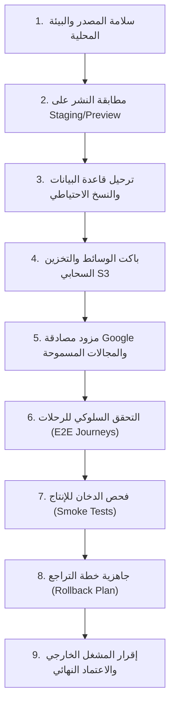

# قائمة تدقيق جاهزية الإطلاق والإنتاج — Production Release Checklist
**مشروع ديرتك / كيان (DAIRTAK / Kayan City Spot)**  
**تاريخ التحديث:** 2026-09-05  
**الفرع المستهدف:** `agent/preproduction-integration` → `main`  
**بيئة المراجعة:** Staging (`swsobooavcvmyejsuwlg`) / Vercel Preview  

---

## البوابات التسع لجاهزية الإطلاق (The 9 Release Gates)

---

### البوابة 1: سلامة المصدر والبيئة المحلية (Source Code & Environment Hygiene)
- [x] **توافق بيئة التشغيل**: تم التحقق محلياً باستخدام Node v22.23.2 من مجلد npm-cache (`C:\Users\pc\AppData\Local\npm-cache\_npx\52027bd8fc0022aa\node_modules\node\bin\node.exe`) وهو مطابق تماماً لخاصية `engines: { "node": "22.x" }`.
- [ ] **نظافة مسار العمل (Git Cleanliness)**: حسم الملفات غير المتتبعة ودمج التغييرات دون تعليق مسودات تجريبية.
- [x] **فحص الأنواع الصارم (TypeScript)**: تشغيل `npm run typecheck` دون أخطاء (`0 errors`).
- [x] **التدقيق البرمجي (ESLint)**: خلو كافة ملفات المشروع من أي أخطاء أو تحذيرات معطلة (`0 errors`).
- [x] **التدقيق الأمني للتبعيّات (Security Audit)**: ترقية `fast-uri` إلى 3.1.7 وحل الثغرة العالية GHSA-f65p-4m7j-42xc بنجاح دون تخفيض `exceljs`؛ اجتياز بوابة التدقيق بنجاح (`Exit Code 0`).
- [x] **ميزانية الحزم (Bundle Budget)**: نجاح اختبار `npm run check:bundle` بنسبة 100% (Main JS: 132.5 KiB / 250 KiB، CSS: 65.8 KiB / 90 KiB).

---

### البوابة 2: مطابقة النشر على Staging/Preview (Deployment Parity)
- [ ] **معالجة تباعد بيئة النشر (Preview Deployment Drift)**: أحدث Preview يعيد `503 Service Unavailable` مع `schemaVersion = 20260830115034` (إصدار تسليم العقارات القديم)، بينما يتوقع كود المصدر `20260831060617`. يجب إعادة بناء النشر على Vercel Preview ومزامنة المتغيرات.
- [ ] **تزامن متغيرات البيئة**: التحقق من مطابقة المتغيرات المشتركة بين البيئة المحلية وPreview وStaging دون تسريب أسرار السيرفر للمتصفح.
- [ ] **صحة المسارات الصحية (Health Probes)**:
  - فحص الاستجابة الحية: `GET /api/health/live` يعيد `200 OK`.
  - فحص الجاهزية التشغيلية: `GET /api/health/ready` يعيد `200 OK` ومطابقة إصدار المخطط مع قاعدة البيانات.

---

### البوابة 3: ترحيل قاعدة البيانات والنسخ الاحتياطي (Database Migrations & Backup)
- [ ] **النسخ الاحتياطي الكامل (Full Pre-Migration Backup)**: أخذ نسخة احتياطية فورية لقاعدة بيانات الإنتاج قبل تنفيذ أي أمر ترحيل.
- [x] **تسلسل ملفات الترحيل وسلامتها**:
  - تم إزالة الـ Placeholder الفارغ غير المطبق `20260831062230_verified_onboarding_release_marker.sql` (0 bytes).
  - إنشاء ملف الترحيل الجديد `20260905203103_verified_onboarding_release_marker.sql` كأحدث علامة إصدار بعد الـ hotfixes.
  - نجاح فحص `scripts/check-migrations.mjs` بالعقد الأصلي الصارم لـ 59 ملف ترحيل دون استثناءات.
- [x] **مطابقة علامة الإصدار (Release Marker)**:
  - التأكد من مطابقة `EXPECTED_SCHEMA_VERSION = 20260905203103` ومسار الجاهزية `/api/health/ready`.
  - **تم التطبيق والتحقق على Staging:** طبّق المشغل الترحيل `20260905203103` على بيئة Staging؛ وأكد استعلام SQL: `schema_version = 20260905203103`، و`release_ready = true`، و`migration_recorded = 1`.
  - بيئة Supabase Staging مؤكدة بأنها في حالة سليمة (Healthy).
- [ ] **مؤشرات Security & Performance Advisors على Staging**:
  - **Security Advisor**: 0 ERROR، 164 WARN (دوال `SECURITY DEFINER` مقصودة؛ الحذر من سحب الصلاحيات عشوائيًا)، 51 INFO (جداول RLS بدون policy مخصصة للـ service_role).
  - **Performance Advisor**: 19 مفتاح أجنبي غير مفهرس (unindexed foreign keys)، 33 سياسة سماح متعددة (multiple permissive policies) تتطلب مراجعة مستهدفة.

---

### البوابة 4: باكت الوسائط والتخزين السحابي S3 (Object Storage & Private Media)
- [ ] **عزل الباكتات (Bucket Separation)**:
  - باكت عام للوسائط المنشورة والمعتمدة (`marketplace-media-public`).
  - باكت خاص لمسودات الانضمام والمحادثات المراقبة (`marketplace-media-private`).
- [ ] **إعداد الروابط الموقعة (Signed URLs)**: التأكد من قصر روابط الوسائط الخاصة على روابط مؤقتة ومحددة الصلاحية (Presigned URLs) دون فتح صلاحية الوصول العام.
- [ ] **مفاتيح الوصول لخدمة DigitalOcean Spaces / S3**:
  - **عائق مؤكد حالياً:** غياب مفتاح `DO_SPACES_SECRET_ACCESS_KEY` في قائمة متغيرات Vercel Preview لهذا الفرع؛ يجب حقنه من المشغل.
  - تنفيذ اختبار فحص التخزين السحابي: `npm run smoke:storage`.

---

### البوابة 5: مزود مصادقة Google والمجالات المسموحة (Google OAuth Configuration)
- [ ] **تفعيل المزود على Supabase**:
  - **عائق مؤكد حالياً:** إعدادات المصادقة في Staging تؤكد `GoogleEnabled = false`. يجب تفعيل Google Provider في لوحة Supabase وإدخال Client ID وSecret.
- [ ] **قائمة الروابط المسموحة (Redirect Allowlist)**:
  - تسجيل رابط الكولباك الرسمي: `https://<domain>/auth/callback`.
  - التحقق من دعم مسار العودة الآمن عبر الكوكيز الموقعة `oauth-origin`.
- [ ] **عزل الحسابات القديمة**: التحقق من عدم الربط التلقائي بين حسابات السائقين والإدارة القديمة وحسابات Google المنشأة حديثًا.

---

### البوابة 6: التحقق السلوكي للرحلات (End-to-End User Journeys)
- [ ] **رحلة العميل والدليل (Customer & Real Estate)**:
  - تصفح الدليل وتصفية قسم «عقارات» المستقل.
  - إخفاء أزرار الدفع والسلة في عقود وتفاصيل العقارات.
  - تصفح الماركت بليس واستخدام فلاتر الموبايل والتأكد من انغلاق الـ Drawer وحفظ خيارات التصفية بالرابط.
- [ ] **رحلة السلة والطلب (Cart & Checkout)**:
  - إضافة منتجات من متجر محدد إلى السلة.
  - ملء نموذج الشراء بالبيانات المقبولة وإنشاء الطلب بنجاح.
- [ ] **رحلة المحادثات الحية (Monitored Live Chat)**:
  - بدء محادثة بين العميل والمتجر ومطابقة استلام الرسائل وتبادل الصور عبر الروابط الموقعة.
- [ ] **رحلة انضمام النشاط (Activity Onboarding)**:
  - تسجيل الدخول بحساب Google.
  - اختيار أحد الأنشطة الـ 5 وملء النموذج وحفظ المسودة واسترجاعها بعد التحديث.
  - إرسال الطلب للاعتماد ومراجعة الإدارة له.
- [ ] **لوحة الإدارة والتاجر والسائق**:
  - التحقق من طلب المصادقة الثنائية (MFA) للوصول الحساس في لوحة الإدارة.
  - متابعة استلام السائق وتحديث مراحل الطلب ذريًا.

---

### البوابة 7: فحص الدخان للإنتاج (Production Smoke Test)
- [ ] **التحميل الأولي للشاشات**: التأكد من تحميل الصفحة الرئيسية، الماركت بليس، تسجيل الدخول، وصفحات الأنشطة دون أخطاء 500.
- [ ] **الاستجابة لشاشات الأجهزة (Responsive Layouts)**:
  - فحص شاشات الموبايل (390px): سهولة اللمس وظهور القوائم والدرج السفلي.
  - فحص شاشات التابلت (768px): اتساق الشبكة وتوزيع البطاقات.
  - فحص الشاشات العريضة (1440px): ثبات شريط التصفية وعدم تمدد الحاويات بصورة غير طبيعية.
- [ ] **حالات الفراغ والخطأ (Empty & Error States)**: وضوح النصوص التوجيهية باللغة العربية عند خلو المنتجات أو انقطاع الاتصال.

---

### البوابة 8: خطة الطوارئ والاسترجاع الفوري (Rollback & Disaster Recovery)
- [ ] **تحديد نقطة الاسترجاع في Git**: تحديد Commit السابق المستقر للإنتاج لتنفيذ Vercel Instant Rollback بنقرة واحدة عند الحاجة.
- [ ] **خطة تراجع قاعدة البيانات (Database Down-Migrations)**: توثيق وتجهيز سكربتات التراجع عن التعديلات المضافة في حال حدوث عطل في المخطط.
- [ ] **استعادة النسخة الاحتياطية**: التأكد من وجود مسار معتمد لاستعادة أحدث Snapshot لقاعدة البيانات عبر لوحة Supabase.
- [ ] **إجراءات التواصل والإيقاف المؤقت**: توفير صفحة صيانة مجهزة في حال استلزم الإصلاح إيقاف حركة المرور مؤقتًا.

---

### البوابة 9: إقرار المشغل الخارجي والاعتماد النهائي (External User Verification)
- [ ] **تأكيد مفاتيح البيئة الحساسة**: إقرار مسؤول النظام بإدخال مفاتيح الإنتاج في Vercel وعدم وجود أي مفاتيح مسربة في الكود.
- [ ] **فحص اعتماد Google Console**: مطابقة نطاق الإنتاج في Google Cloud Console وشاشة الموافقة (OAuth Consent Screen).
- [ ] **اعتماد المشرف للبدء**: الحصول على موافقة خطية صريحة لنشر الفرع `main` وتفعيل ترحيلات الإنتاج.
